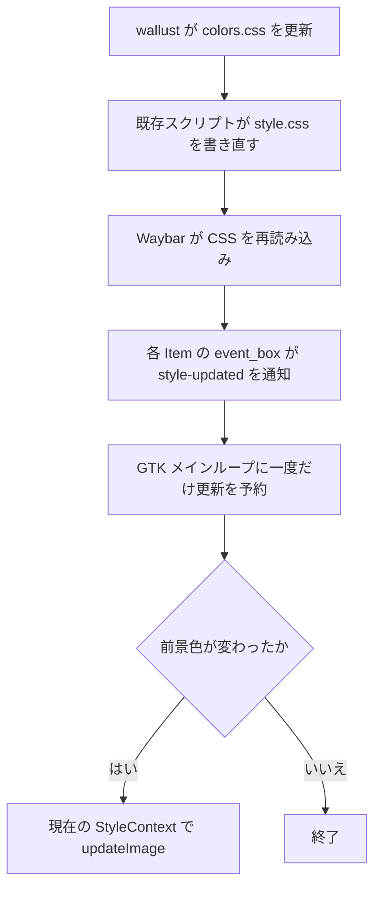

# Waybar トレイの壁紙配色追従

壁紙変更後、Fcitx の symbolic アイコンを新しい `@color6` で再描画する。
バーの再起動や surface の再生成を行わず、現在のタイル配置を維持する。
この文書は実装前の設計であり、動作検証の結果ではない。

## 確認した構成

Nix の評価結果は Waybar 0.15.0、既存の `patches` は空配列だった。
取得した固定ソースは `/nix/store/m2nf72757wlzmw6pslbgaadw597igjsm-source`。
実行中のトレイには Fcitx が登録され、`IconName` は `input-keyboard-symbolic`、`IconThemePath` は空文字だった。

`style.css` は `#tray` に `color: @color6` を指定している。
壁紙変更時は wallust が `colors.css` を生成し、`home-manager/desktop/waybar/scripts/reload-css.sh` が `style.css` を書き直す。
Waybar は `reload_style_on_change` によって CSS を読み直す。

固定ソースの `Item::getIconByName()` はトレイ項目の StyleContext を画像ローダーへ渡す。
`DefaultGtkIconThemeWrapper::load_icon()` は `load_symbolic()` を使い、`Item::updateImage()` は結果を Cairo surface に変換して `Gtk::Image` に設定する。
一方、Item は CSS の変更を契機に画像を更新していない。
この経路が今回の症状の原因と考えられるが、パッチ前後の実画面比較で確定する。

## 更新処理

`event_box.signal_style_updated()` にハンドラーを接続する。
画像ローダーに渡している StyleContext と同じウィジェットを監視する。
通知の中で画像を生成せず、GLib の idle コールバックに処理を予約する。
これにより GTK のスタイル計算中の再入と、アイコンテーマのロック中に同じローダーへ入ることを避ける。
予約済みの場合は新しい予約を作らない。

idle コールバックは `get_color(get_state())` で現在の前景色を取得する。
前回処理した RGBA と一致する場合は画像を更新しない。
異なる場合は比較用の色を先に記録してから `updateImage()` を呼ぶ。
画像設定が後続のスタイル通知を発生させても、同じ色での画像生成は繰り返さない。

今回の検知対象は `@color6` が変える前景色である。
symbolic アイコンの意味色だけの変更や、アイコンテーマ自体の変更を新たに検知する機能は含めない。
既存の D-Bus によるアイコン変更と configure イベントの更新は維持する。
通常のカラー画像を単色に変換する処理も追加しない。

## 初期化と破棄

- `proxyReady()` で必須プロパティを検証した後に `icon_ready_` を有効にする。
- 準備前のスタイル通知は無視する。初回画像は既存の `proxyReady()` の更新経路で描画する。
- idle コールバック内でも準備状態を確認する。
- idle の `sigc::connection` を Item のメンバーとして保持し、デストラクターの先頭で切断する。
- シグナル接続には `sigc::mem_fun` を使い、既存の `sigc::trackable` に寿命管理を合わせる。
- 新しいコールバックの `Glib::Error` と `std::exception` はログに記録し、GTK のイベント境界を越えて送出しない。
- `updateImage()` には空 Pixbuf のガードを追加し、画像取得失敗時は既存の画像を維持する。

## ファイルと適用範囲

| リポジトリのファイル                                                     | 変更                                                                                    |
| ------------------------------------------------------------------------ | --------------------------------------------------------------------------------------- |
| `home-manager/desktop/waybar/patches/refresh-tray-on-style-change.patch` | 新規。Waybar の `include/modules/sni/item.hpp` と `src/modules/sni/item.cpp` を変更する |
| `home-manager/desktop/waybar/default.nix`                                | `pkgs` 引数を追加し、`programs.waybar.package` にパッチ付きパッケージを指定する         |

`pkgs.waybar.overrideAttrs` で既存の `patches` に追記する。
グローバル overlay を追加せず、この Home Manager の Waybar に適用する。
CSS、JSONC、壁紙変更スクリプトの変更は不要である。
製品コードの追加は合計60〜100行程度を見込むが、差分ヘッダーと検証資料は含まない。

## 合格条件

1. パッチなしで、Fcitx のアイコン色が CSS の色変更に追従しないことを再現する。
2. パッチありでは、ポインター移動や入力方式変更をしなくても新しい色になる。
3. 壁紙変更中に Waybar の PID、レイヤー surface、既存タイルの位置と寸法が維持される。
4. 同色の CSS 更新を繰り返しても画像の再生成を続けず、更新後に CPU 使用が落ち着く。
5. 起動直後の CSS 更新、トレイ項目の削除、Fcitx の入力方式変更、クリックとメニュー表示が正常に動作する。
6. 複数モニターすべてのトレイに反映される。

パッチ適用とコンパイルの成功だけでは、色追従の修正完了とは扱わない。
最初のパッチ付きバイナリへの切り替えには一度の Waybar 再起動が必要である。
その後の壁紙変更では再起動しない。

## 保守と取り消し

Waybar 更新時はパッチ適用、ビルド、上記の実画面検証を再実行する。
上流に同等の修正が入った場合はローカルパッチと package override を削除する。
取り消す場合もこの2箇所を戻して再ビルドし、元の Waybar に切り替える。

## 根拠

- [Waybar 0.15.0 Item 実装](https://github.com/Alexays/Waybar/blob/0.15.0/src/modules/sni/item.cpp)
- [Waybar 0.15.0 アイコンローダー](https://github.com/Alexays/Waybar/blob/0.15.0/src/util/gtk_icon.cpp)
- [GTK 3 の style-updated シグナル](https://docs.gtk.org/gtk3/signal.Widget.style-updated.html)
